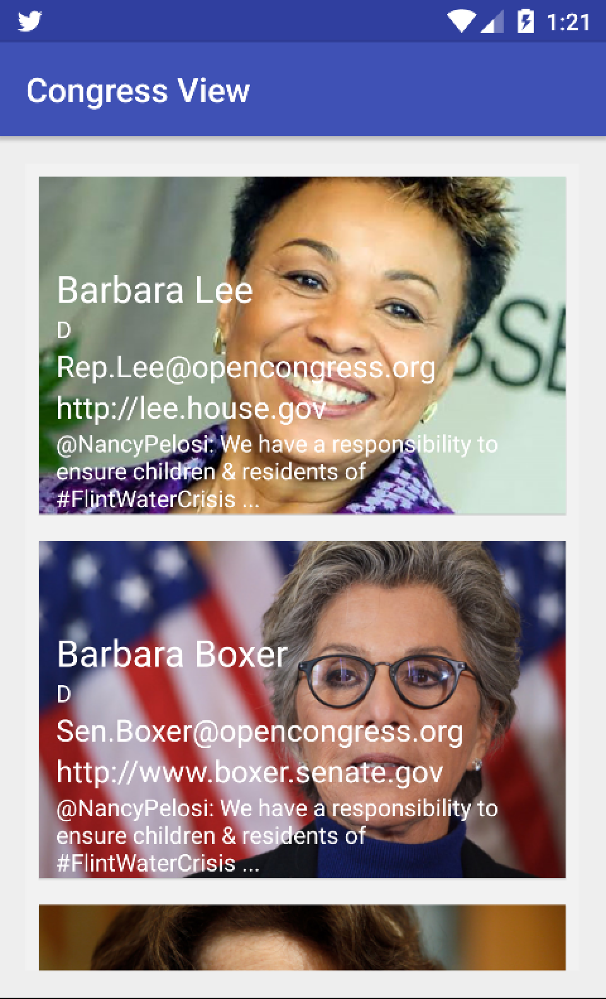

# PROG 02: Represent!

Caucus, Primary, Debate, Delegates, Issues! How can we find the signal in all the noise and hype as we approach the 2016 US Presidential Election? 

I have been tasked to help design a groundbreaking mobile and smartwatch application to deliver facts to voters on the go.

This is phase two of a three phase assignment. 
## Authors

Audrey Leung ([audreycml@berkeley.edu](mailto:audreycml@berkeley.edu))

## Demo Video

See [Prog02B Video] (https://youtu.be/VE9ee2vZaGQ)
See [Prog02C Video] (https://youtu.be/mecc-HCJoNE)

## Screenshots

## Acknowledgments

* http://www.raywenderlich.com/103367/material-design
* https://github.com/MeghaBambra/android-material-travellist
* http://stackoverflow.com/questions/28541459/getting-403-forbidden-when-using-twitter-fabric-to-get-user-timeline
* https://www.udemy.com/the-complete-android-developer-course/learn/
* CS160 Staff (Catnip starter code)
* Linus Wong
